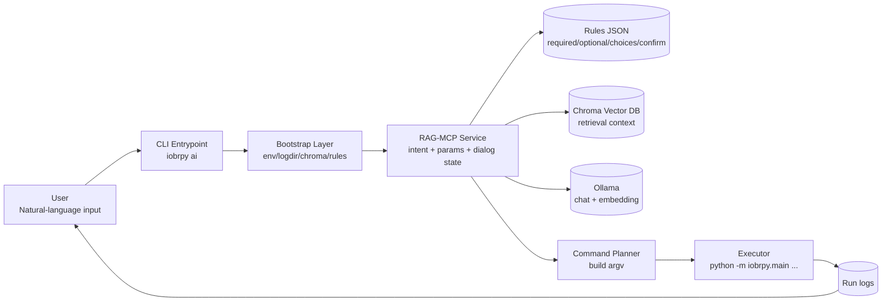

# IOBRpy AI Architecture (Draft v0.2)

> This document describes the `iobrpy ai` architecture, including module boundaries, runtime flow, safety constraints, and extension guidance.

---

## 1) Goals and Non-goals

### Goals
- Provide a natural-language interactive entrypoint for IOBRpy via `iobrpy ai --logdir ...`.
- Complete command preparation before execution:
  - subcommand intent selection,
  - parameter extraction,
  - missing-parameter follow-up,
  - confirmation of key parameters.
- Enforce strict parameter constraints to prevent unsafe or accidental execution.
- Execute real IOBRpy commands in the current Python environment with traceable logs.

### Non-goals
- Replacing native validation already implemented by individual `iobrpy` CLI subcommands.
- Re-implementing bioinformatics algorithms (deconvolution, scoring, clustering, etc.).
- Guaranteeing identical model behavior across different LLM backends.

---

## 2) High-level Architecture

---

## 3) Runtime Flow (Request Lifecycle)

1. User starts `iobrpy ai --logdir <dir>`.
2. Bootstrap sets runtime environment values (embedded Chroma, rules path, log paths, model config).
3. A `session_id` is created and an interactive dialog loop starts.
4. For each user turn, the service performs:
   - intent/subcommand selection,
   - allowed-parameter filtering,
   - parameter extraction,
   - missing-parameter detection,
   - confirmation requests when required.
5. Once run conditions are satisfied, the planner builds CLI arguments.
6. Executor runs:
   - `python -m iobrpy.main <subcommand> ...`
7. Full output is written to `<logdir>/<session>_<subcommand>.log`; tail content is shown back to the user.

---

## 4) Module Responsibilities

### 4.1 `src/iobrpy/RAG_MCP/ai.py`
- Interactive entrypoint and conversation loop.
- Environment initialization for embedded assets and user-writable state.
- Calls the assistant tool to advance state (`need_info` / `ready` / `done` / `error`).
- Executes real IOBRpy command in the current environment and captures logs.

### 4.2 `src/iobrpy/RAG_MCP/iobrpy_rag_mcp.py`
- Core MCP/JSON-RPC service implementation.
- RAG retrieval + intent routing + parameter extraction.
- Command building and option validation guardrails.
- Language handling helpers (including Chinese/English conversion support).

### 4.3 `src/iobrpy/RAG_MCP/iobrpy_required_params.json`
- Parameter contract per subcommand:
  - `required`, `optional`, `confirm`, `choices`, `notes`.
- Intent trigger hints (multilingual).
- Parameter hints/defaults for follow-up prompts.

---

## 5) Safety and Guardrails

- **Strict allowlist**: only parameters defined in rules are considered.
- **No guessing**: values must be supported by user-provided evidence.
- **Confirm-first for critical fields**: selected parameters can require explicit confirmation.
- **Execution transparency**: draft command is visible before run.
- **Traceability**: every run writes to a persistent log file.

---

## 6) Configuration Surface

Common environment variables:

- `CHROMA_DIR`
- `IOBRPY_REQUIRED_PARAMS_FILE`
- `IOBRPY_RUN_LOG_DIR`
- `IOBRPY_DEFAULTS_FILE`
- `OLLAMA_HOST`
- `CHAT_MODEL`
- `EMBED_MODEL`

Operational recommendations:
- Pin model versions in deployment environments.
- Keep rules JSON versioned with code releases to avoid contract drift.
- Use writable runtime directories for logs/defaults (avoid package install paths).

---

## 7) Relationship to “Skill” (Conceptual)

This architecture is compatible with a skill-oriented workflow model:

- **Architecture document** explains system structure, responsibilities, and invariants.
- **Skill definition** (if introduced) explains reusable task procedures.

Suggested mapping:
- Keep command contracts in rules JSON.
- Add task-level skills for common workflows (for example `runall`, `tme_profile`, `count2tpm`).
- Let skills reference this architecture and rule contracts for consistency.

---

## 8) Extension Playbook

### Add a new subcommand to `iobrpy ai`
1. Add a new rule entry in `iobrpy_required_params.json`.
2. Define `required/optional/confirm/choices/intent_keywords`.
3. Add parameter hints and defaults when helpful.
4. Validate with dialog dry-runs:
   - missing required fields trigger follow-up,
   - unsupported flags are excluded from draft,
   - complete inputs become runnable.

### Replace retrieval/model backends
- Retrieval backend can be replaced if query/result semantics are preserved.
- LLM backend can be replaced if JSON output contracts are preserved.

---

## 9) Known Risks (Draft)

- Contract drift between CLI options and rules JSON.
- JSON-output variability from LLM responses.
- Multilingual normalization edge cases for paths/flags.
- Availability dependency on local model/vector services.

---

## 10) Next Steps

- [ ] Add a sequence diagram for the `need_info -> ready -> done/error` state machine.
- [ ] Add a failure-handling matrix (model unavailable, Chroma unavailable, invalid paths).
- [ ] Add an “add-new-subcommand” checklist template.
- [ ] Link this document from `README.md` for discoverability.

