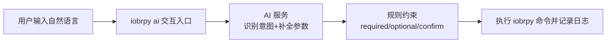

# IOBRpy AI 架构说明
> 本文档用于说明 `iobrpy ai` 的系统架构、模块边界、运行流程、安全约束与扩展方式。

---

## 1）目标与非目标

### 目标
- 提供自然语言交互入口：`iobrpy ai --logdir ...`。
- 在执行命令前完成：
  - 子命令意图识别，
  - 参数提取，
  - 缺失参数追问，
  - 关键参数确认。
- 通过严格参数约束，降低误执行和不安全执行风险。
- 在当前 Python 环境执行真实 IOBRpy 命令，并保留可追溯日志。

### 非目标
- 不替代各 `iobrpy` 子命令自身已有的参数校验能力。
- 不重写生信算法本体（如 deconvolution、signature scoring、clustering）。
- 不保证不同 LLM 后端在输出风格与结果上的完全一致。

---

## 2）总体架构

可以把系统理解成 **4 层**，从上到下非常直观：

1. **交互层（你看到的）**：用户在终端输入自然语言。
2. **理解层（AI 大脑）**：识别你要用哪个子命令、缺什么参数、要不要继续追问。
3. **约束层（安全护栏）**：只允许规则文件中声明的参数，避免乱猜、乱传。
4. **执行层（真正跑命令）**：拼好参数后执行 `python -m iobrpy.main ...`，并写日志。

对应的最简流程如下：

一句话总结：**先理解，再约束，最后执行**。

---

## 3）运行流程（请求生命周期）

1. 用户启动 `iobrpy ai --logdir <dir>`。
2. 启动层设置运行时环境（内置 Chroma、规则文件、日志路径、模型配置）。
3. 创建 `session_id`，进入交互循环。
4. 每轮对话由服务层执行：
   - 意图/子命令选择，
   - 允许参数过滤，
   - 参数提取，
   - 缺失参数检测，
   - 必要时发起确认。
5. 当运行条件满足后，规划器构建 CLI 参数。
6. 执行器运行：
   - `python -m iobrpy.main <subcommand> ...`
7. 全量输出写入 `<logdir>/<session>_<subcommand>.log`，并向用户回显日志尾部。

---

## 4）模块职责

### 4.1 `src/iobrpy/RAG_MCP/ai.py`
- 交互入口与对话循环。
- 初始化运行环境（内置资源 + 可写状态目录）。
- 调用 assistant 工具推进状态（`need_info` / `ready` / `done` / `error`）。
- 在当前环境执行真实命令并记录日志。

### 4.2 `src/iobrpy/RAG_MCP/iobrpy_rag_mcp.py`
- MCP/JSON-RPC 核心服务。
- 负责 RAG 检索、意图路由、参数提取与状态推进。
- 负责命令组装与选项校验防护。
- 提供中英文处理辅助能力。

### 4.3 `src/iobrpy/RAG_MCP/iobrpy_required_params.json`
- 定义各子命令参数契约：
  - `required`、`optional`、`confirm`、`choices`、`notes`。
- 定义意图触发提示（多语言）。
- 提供参数提示与默认值。

---

## 5）安全约束与防护

- **严格白名单**：仅处理规则中声明的参数。
- **不猜参数**：值必须有用户输入证据支持。
- **关键参数先确认**：对高风险字段可配置显式确认。
- **执行透明**：运行前可见草拟命令（draft command）。
- **可追溯**：每次运行均写入持久化日志。

---

## 6）配置面

常见环境变量：

- `CHROMA_DIR`
- `IOBRPY_REQUIRED_PARAMS_FILE`
- `IOBRPY_RUN_LOG_DIR`
- `IOBRPY_DEFAULTS_FILE`
- `OLLAMA_HOST`
- `CHAT_MODEL`
- `EMBED_MODEL`

运维建议：
- 在部署环境固定模型版本。
- 规则 JSON 与代码版本同步发布，避免契约漂移。
- 日志与默认配置使用可写目录，避免写入 site-packages。

---

## 7）与 Skill 的关系（概念层）

可将两者理解为互补：

- **架构文档**：回答系统“是什么、如何工作、边界是什么”。
- **Skill（如后续引入）**：回答“某类任务应该按什么流程做”。

建议映射：
- 命令契约继续由 rules JSON 维护。
- 常见任务（如 `runall`、`tme_profile`、`count2tpm`）可沉淀为任务型 skill。
- skill 可引用本架构文档与规则契约，保证一致性。

---

## 8）扩展手册

### 为 `iobrpy ai` 新增子命令
1. 在 `iobrpy_required_params.json` 增加新条目。
2. 定义 `required/optional/confirm/choices/intent_keywords`。
3. 补充参数提示与默认值（如需要）。
4. 用对话 dry-run 验证：
   - 缺失必填会追问，
   - 不支持参数不进入 draft，
   - 参数齐备后可执行。

### 替换检索/模型后端
- 检索后端可替换，但需保持查询/结果语义一致。
- LLM 后端可替换，但需保持 JSON 输出契约一致。

---

## 9）已知风险（草案）

- CLI 实际选项与 rules JSON 存在漂移风险。
- LLM JSON 输出稳定性会影响参数提取质量。
- 多语言标准化可能引入路径/flag 边缘错误。
- 依赖本地模型与向量服务可用性。

---

## 10）后续计划

- [ ] 增加统一 API 接入层（支持本地服务与远程服务两种模式）。
- [ ] 定义稳定的请求/响应 JSON Schema（含错误码与可观测字段）。
- [ ] 增加鉴权能力（如 API Key / Token）与基础限流策略。
- [ ] 打通 API 与会话状态机（`need_info -> ready -> done/error`）映射。
- [ ] 为 API 增加运行日志查询与任务状态查询接口。
- [ ] 在 `README.md` 增加 API 使用示例与端到端调用说明。
