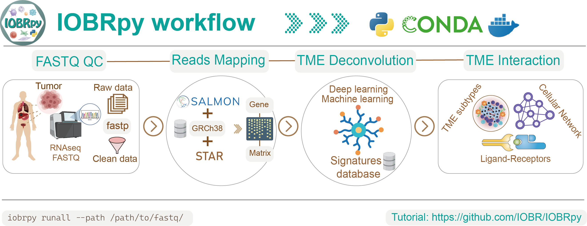

{fig-align="center" width="100%"}

**IOBRpy** is a **command-line toolkit** for bulk RNA-seq tumor microenvironment (TME) analysis. It wires together FASTQ QC, quantification (Salmon or STAR), matrix assembly, signature scoring, immune deconvolution, clustering, and ligand–receptor scoring.

---

## Input Requirements
- **FASTQ layout**: paired-end by default. Filenames end with `*_1.fastq.gz` / `*_2.fastq.gz` (configurable via `--suffix1`).
- **Expression matrix orientation**: **genes × samples** by default.
- **Output file delimiters**: automatically inferred from the file extension; .csv and .tsv/.txt are recommended.